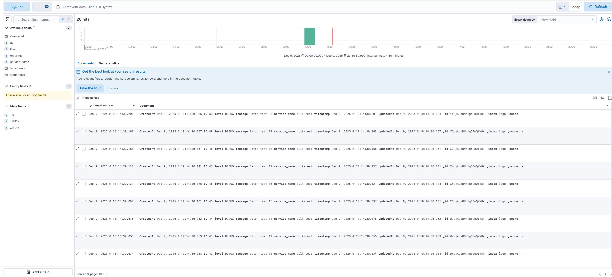
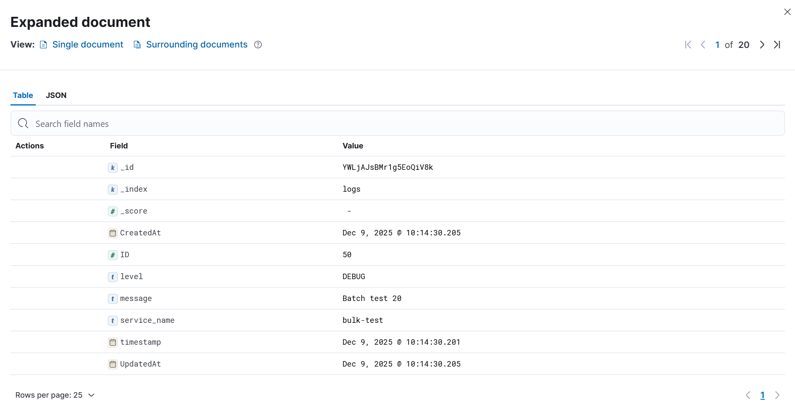
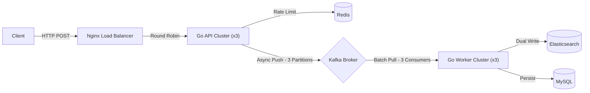
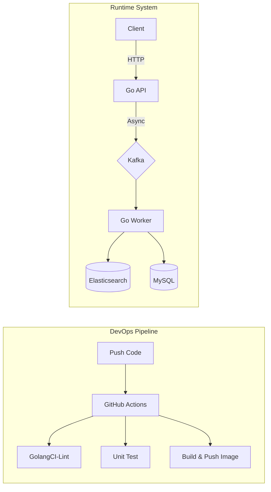

# LogPulse

[](https://golang.org/)
[](https://www.docker.com/)
[]()

> A high-throughput, distributed log aggregation system engineered with Go, Kafka, Elasticsearch, and Redis.

## Introduction

LogPulse is a cloud-native backend solution designed to handle massive scale log ingestion and real-time analytics. It addresses the challenge of "Peak Shaving" in high-concurrency scenarios by decoupling the ingestion layer from the storage layer.

Built with a Microservices mindset, LogPulse ensures data consistency and system resilience through asynchronous messaging and a robust caching strategy.

### Dashboard Preview

> Real-time log ingestion visualization in Kibana. This demonstrates the successful flow of data from the **Go API** through **Kafka** to **Elasticsearch**.




### Architecture

The system follows an Event-Driven Architecture:





### Design Decisions & Trade-offs

* **Why Kafka over RabbitMQ?**
    * LogPulse requires high-throughput sequential writing. Kafka's log-based storage offers superior performance for peak shaving (100k+ msg/sec) compared to RabbitMQ's complex routing.
* **Why Elasticsearch?**
    * MySQL performs poorly on fuzzy text search (`LIKE %...%`). ES provides Inverted Indexing, enabling O(1) search complexity for log keywords.
* **Hybrid Data Strategy (The "Write-Async, Read-Aside" Pattern)**
    * **Ingestion (Write):** We use **Asynchronous Write** via Kafka. This ensures the API remains low-latency (<10ms) even if the storage layer is under heavy load.
    * **Retrieval (Read):** We employ the **Cache-Aside Pattern** for specific log retrieval. Data is loaded into Redis only upon request (Lazy Loading), optimizing memory usage by not caching the entire log stream.

## Key Features

*   **High Concurrency Ingestion**: Utilizing Kafka as a buffer to handle traffic spikes and prevent database overload (Peak Shaving).
*   **Full-Text Search**: Integrated Elasticsearch for efficient log indexing and fuzzy search capabilities (CQRS Pattern).
*   **Rate Limiting**: Implemented Redis (Token Bucket / Counter) to protect the API from abuse (DDoS protection).
*   **Clean Architecture**: Codebase structured into Controller, Service, and Repository layers with Dependency Injection, ensuring testability and maintainability.
*   **Fully Containerized**: "One-Click Deployment" for the entire stack (App, DB, Broker, Search) using Docker Compose.
*   **CI/CD Pipeline**: Automated linting, testing, and image building via GitHub Actions.
*   **DevOps Ready**: Implemented Graceful Shutdown and Health Checks for zero-downtime deployments.

## Getting Started

### System Requirements

Since this stack involves heavy infrastructure (Elasticsearch, Kafka), please ensure your environment meets the minimum requirements:

* **RAM:** 4GB minimum free memory (8GB recommended).
* **Disk:** 10GB free space.
* **Note:** If you are running on low memory, consider disabling Kibana in `docker-compose.yml` to save resources.

### Prerequisites

* **Docker** & **Docker Compose** installed.
* **Make** (Optional, for simplified commands).

### Quick Start (Recommended)

We provide a `Makefile` to simplify common operations.

1. **Clone the repository**

   ```bash
   git clone https://github.com/Yupoer/logpulse.git
   cd logpulse
   ```

2. **Run the application**

   ```bash
   make run
   ```

   This command will automatically build the images and start all services (App, MySQL, Redis, Kafka, ES, Kibana) in the background.
   
   > **Note:** By default, `make run` initializes **3 Go Application Replicas** (API + Worker) and **3 Kafka partitions/consumers** behind an **Nginx Load Balancer** to simulate a production-ready distributed environment.

3. **Stop the application**

   ```bash
   make stop
   ```

### Manual Start (Without Make)

If you are on Windows (without WSL) or don't have `make` installed, you can use the raw Docker commands:

```bash
# Start services
docker-compose -f deployments/docker-compose.yml up -d --build

# Stop services
docker-compose -f deployments/docker-compose.yml down
```

### Verify Status

```bash
docker-compose ps
# OR if you configured it in Makefile:
# make ps
```


### Troubleshooting

If you encounter `bind: address already in use` or Windows WinNAT port issues:

1. Open the `.env` file in the root directory.
2. Change the conflicting port (e.g., change `KIBANA_PORT` from `5601` to `5602`).
3. Run `make run` again.

## API Usage Examples

### Quick Test (VS Code)

We provide an `apiTest.http` file for convenient testing directly within VS Code.

1. Install the **[REST Client](https://marketplace.visualstudio.com/items?itemName=humao.rest-client)** extension.
2. Open the `apiTest.http` file in this repository.
3. Click the **Send Request** link that appears above each API call to interact with your running services.

### 1. Ingest a Log (Producer)

Send a log entry to the system. The API will respond immediately (Async).

```bash
curl -X POST http://localhost:8080/logs \
  -H "Content-Type: application/json" \
  -d '{
    "service": "payment-service",
    "level": "error",
    "message": "Transaction failed due to timeout",
    "timestamp": "2023-12-05T10:00:00Z"
  }'
```

### 2. Search Logs (Consumer & Reader)

Search logs via Elasticsearch.

```bash
curl "http://localhost:8080/logs/search?q=timeout&level=error"
```

## Project Layout

The project follows the Standard Go Project Layout:

```plaintext
.
├── cmd/
│   └── api/
│       └── main.go       # Application entry point
├── configs/
│   └── config.yaml       # Configuration file
├── deployments/
│   └── docker-compose.yml # Infrastructure definition
├── internal/
│   ├── config/           # Configuration loading
│   ├── domain/           # Domain models
│   ├── handler/          # HTTP Handlers (Gin)
│   ├── repository/       # Data Access (MySQL, Redis, ES, Kafka)
│   └── service/          # Business Logic
├── pkg/
│   └── utils/            # Shared utilities
├── nginx/
│   └── nginx.conf        # Nginx Load Balancer Configuration
├── .env                  # Environment variables (if don't have one, 'make run' will auto create one)
├── .golangci.yml         # Linting configuration
├── Dockerfile            # Container definition
├── Makefile              # Management commands
└── README.md
```

## License

Distributed under the MIT License. See LICENSE for more information.