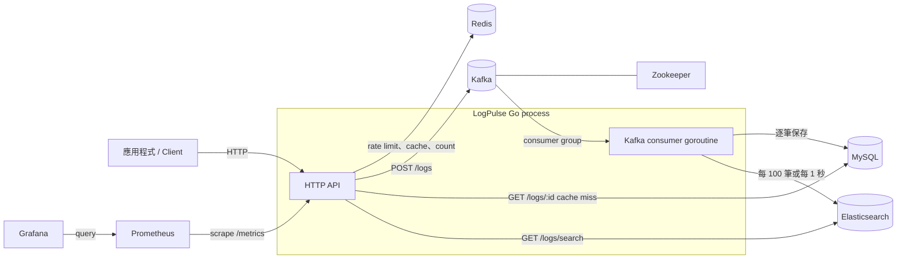

# LogPulse

LogPulse 是一個用 Go 開發的日誌收集與搜尋服務。

應用程式把日誌送到 LogPulse 的 HTTP API；LogPulse 先將資料寫入 Kafka，再由同一個 Go process 裡的背景 consumer 寫入 MySQL，並批次建立 Elasticsearch 索引。Redis 提供查詢快取、日誌數量統計與流量限制，Prometheus 和 Grafana 用來查看服務指標。

## 架構


```mermaid
flowchart LR
    Client[應用程式 / Client] -->|HTTP| API

    subgraph Process[LogPulse Go process]
        API[HTTP API]
        Consumer[Kafka consumer goroutine]
    end

    API -->|rate limit、cache、count| Redis[(Redis)]
    API -->|POST /logs| Kafka[(Kafka)]
    API -->|GET /logs/:id cache miss| MySQL[(MySQL)]
    API -->|GET /logs/search| ES[(Elasticsearch)]

    Kafka -->|consumer group| Consumer
    Consumer -->|逐筆保存| MySQL
    Consumer -->|每 100 筆或每 1 秒| ES
    Kafka --- Zookeeper[Zookeeper]

    Prometheus[Prometheus] -->|scrape /metrics| API
    Grafana[Grafana] -->|query| Prometheus
```

資料處理流程：

1. `POST /logs` 驗證 JSON，通過 Redis 流量限制後送入 Kafka。
2. Kafka consumer 從 topic 讀取日誌，逐筆寫入 MySQL。
3. consumer 將日誌累積到 100 筆，或等待 1 秒後，批次寫入 Elasticsearch。
4. `GET /logs/:id` 先查 Redis，未命中時查 MySQL，再把結果放回 Redis。
5. `GET /logs/search` 使用 Elasticsearch 搜尋 `message`、`service_name` 與 `level`。

## 啟動與操作

### Docker Compose

需求：Docker Desktop 與 Docker Compose v2。

```powershell
Copy-Item .env.example .env
docker compose -f deployments/docker-compose.yml up -d --build
docker compose -f deployments/docker-compose.yml ps
```

確認 API：

```powershell
curl.exe http://localhost:8080/ping
curl.exe http://localhost:8080/metrics
```

建立一筆日誌：

```powershell
curl.exe -X POST http://localhost:8080/logs `
  -H "Content-Type: application/json" `
  -d '{"service_name":"payment-service","level":"ERROR","message":"database timeout","timestamp":"2026-09-02T10:00:00Z"}'
```

寫入是非同步的；收到 `201` 代表日誌已送入 Kafka，不代表 MySQL 與 Elasticsearch 已完成寫入。等待 consumer 處理後，可以搜尋：

```powershell
curl.exe "http://localhost:8080/logs/search?q=timeout"
```

停止服務：

```powershell
docker compose -f deployments/docker-compose.yml down
```

Compose 啟動的服務與預設連接埠：

| 服務 | 連接埠 | 用途 |
| --- | ---: | --- |
| LogPulse API | `8080` | HTTP API |
| MySQL | `3306` | 日誌保存 |
| Redis | `6379` | 快取、統計、流量限制 |
| Kafka | `9092` | 日誌訊息佇列 |
| Elasticsearch | `9200` | 日誌搜尋索引 |
| Kibana | `5601` | Elasticsearch 查詢介面 |
| Prometheus | `9090` | 指標收集與查詢 |
| Grafana | `3000` | 指標 dashboard |

Kibana 可在 <http://localhost:5601> 開啟，Grafana 可在 <http://localhost:3000> 開啟；Compose 預設 Grafana 帳號為 `admin`、密碼為 `admin`。

### Kubernetes

`k8s/` 提供 LogPulse、MySQL、Redis、Zookeeper、Kafka、Elasticsearch、Prometheus 與 Grafana 的 Kubernetes manifests。

```powershell
kubectl apply -f k8s/namespace.yaml
kubectl apply -f k8s/config-secret.yaml
kubectl apply -f k8s/backends.yaml
kubectl apply -f k8s/app.yaml
kubectl apply -f k8s/hpa.yaml
kubectl apply -f k8s/monitoring.yaml

kubectl -n logpulse get pods,svc,hpa
kubectl -n logpulse port-forward svc/logpulse 8080:80
```

LogPulse app deployment 預設為 2 個 replicas，使用 `/ping` 做 readiness/liveness probe，HPA 可在 2 至 6 個 replicas 之間依 CPU 調整。

### AWS Terraform

`infra/terraform/aws/` 提供 AWS 基礎設施設定，包含 VPC、public subnets、ECR、EKS、EKS add-ons、GitHub Actions OIDC deploy role 與 budget alert。

```powershell
Set-Location infra/terraform/aws
Copy-Item terraform.tfvars.example terraform.tfvars
terraform init
terraform validate
terraform plan
terraform apply
```

## API

| Method | Endpoint | 功能 |
| --- | --- | --- |
| `GET` | `/ping` | 回傳 `{"message":"pong"}` |
| `GET` | `/metrics` | 回傳 Prometheus text format 指標 |
| `POST` | `/logs` | 將日誌送入 Kafka |
| `GET` | `/logs/:id` | 以 ID 讀取日誌，使用 Redis cache-aside |
| `GET` | `/logs/search?q=keyword` | 以關鍵字搜尋 Elasticsearch |

`POST /logs` 的 request body：

```json
{
  "service_name": "checkout-service",
  "level": "INFO",
  "message": "checkout completed",
  "timestamp": "2026-09-02T10:00:00Z"
}
```

`timestamp` 可以省略，服務會填入目前時間。`GET /logs/search` 必須提供 `q` 參數；格式錯誤會回傳 `400`，超過流量限制會回傳 `429`。

## Features

- **非同步日誌收集**：HTTP API 與 Kafka 解耦，consumer 以 consumer group 讀取訊息。
- **雙用途資料儲存**：MySQL 保存原始日誌，Elasticsearch 提供全文關鍵字搜尋。
- **Elasticsearch 批次索引**：以 100 筆或 1 秒為批次建立索引。
- **Redis cache-aside**：單筆日誌先讀 Redis，未命中再讀 MySQL，成功後快取 1 小時。
- **Redis Token Bucket 流量限制**：依 client IP 限制請求，預設容量為 100，補充速率為每秒 50 個 token。
- **服務可觀測性**：`/metrics` 提供 HTTP request、request duration 與 Kafka processing result，Compose 內含 Prometheus/Grafana dashboard。
- **容器化與水平擴展**：提供 Docker Compose 與 Kubernetes manifests；Kubernetes app deployment 包含 rolling update、健康檢查與 HPA。
- **優雅關閉**：收到 `SIGINT` 或 `SIGTERM` 時停止 HTTP server、停止 Kafka consumer 並等待處理中的批次完成。

## 測試與測試數據

執行 Go 測試與靜態檢查：

```powershell
go test ./...
go vet ./...
go build ./cmd/api
```

目前的自動化測試涵蓋：

- 日誌建立流程與 producer/cache repository 互動。
- Prometheus metrics 輸出與低 cardinality labels。
- Redis Token Bucket 的允許、拒絕、停用與 probe 路徑行為。

壓力測試腳本位於 `test/k6/`。既有混合寫入、讀取與搜尋測試結果如下：

| 測試 | 結果 |
| --- | --- |
| `test/k6/stress_test.js` | 最高 600 VUs、743,453 requests、1,768.70 requests/s、p95 292.41 ms |
| 寫入成功率 | 99.93% |
| 讀取／搜尋成功率 | 100% |

完整輸出保存在 `test/k6/testReport/StressTest.txt`。其中的少量 `429` 是流量限制在高併發下主動拒絕的結果。

## License

[MIT License](LICENSE)
